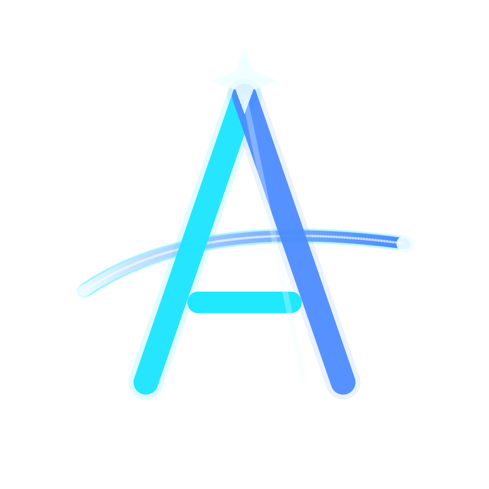

# 🚀 Aetheris

<div align="center">



[](https://github.com/sashaga2a24/installer/stargazers)
[](https://github.com/sashaga2a24/installer/network)
[](https://github.com/sashaga2a24/installer/issues)
[](LICENSE)

**A powerful, cross-platform desktop application for managing your Roblox accounts.**

</div>

## 📖 Overview

Aetheris is a robust and user-friendly desktop application designed to streamline the management of multiple Roblox accounts. Built with Electron, React, and TypeScript, it offers a secure and efficient way for users to handle their Roblox presence directly from their desktop. This application targets Roblox enthusiasts, developers, and power users who need a centralized tool for their account operations.

## ✨ Features

-   **Multi-Account Management**: Easily add, organize, and switch between multiple Roblox accounts.
-   **Modern User Interface**: Intuitive and responsive design powered by React and Tailwind CSS.
-   **Secure Operations**: Designed with best practices for handling sensitive account information.
-   **Cross-Platform Compatibility**: Available for Windows, macOS, and Linux thanks to Electron.

> ⚠️ **Data location** – user configuration and account data are stored in the app user-data directory under `Aetheris`. On first launch after the rename, legacy data is copied forward automatically.
-   **Automatic Updates**: Seamless over-the-air updates ensure you always have the latest features and security patches.
-   **Centralized State Management**: Efficient data flow and state handling using Redux Toolkit.
-   **Type-Safe Development**: Built with TypeScript for enhanced code quality and maintainability.

## 🖥️ Screenshots

<!-- TODO: Add actual screenshots of the application in action -->
<!--


-->
*Screenshots coming soon!*

## 🛠️ Tech Stack

**Desktop Framework:**
<p>
  <a href="https://www.electronjs.org/" target="_blank" rel="noopener noreferrer"></a>
  <a href="https://www.typescriptlang.org/" target="_blank" rel="noopener noreferrer"></a>
  <a href="https://nodejs.org/" target="_blank" rel="noopener noreferrer"></a>
</p>

**Frontend:**
<p>
  <a href="https://react.dev/" target="_blank" rel="noopener noreferrer"></a>
  <a href="https://redux-toolkit.js.org/" target="_blank" rel="noopener noreferrer"></a>
  <a href="https://tailwindcss.com/" target="_blank" rel="noopener noreferrer"></a>
  <a href="https://vitejs.dev/" target="_blank" rel="noopener noreferrer"></a>
  <a href="https://axios-http.com/" target="_blank" rel="noopener noreferrer"></a>
  <a href="https://reactrouter.com/" target="_blank" rel="noopener noreferrer"></a>
  <a href="https://phosphoricons.com/" target="_blank" rel="noopener noreferrer"></a>
</p>

**Dev Tools:**
<p>
  <a href="https://www.electron.build/" target="_blank" rel="noopener noreferrer"></a>
  <a href="https://github.com/electron-userland/electron-updater" target="_blank" rel="noopener noreferrer"></a>
  <a href="https://eslint.org/" target="_blank" rel="noopener noreferrer"></a>
  <a href="https://prettier.io/" target="_blank" rel="noopener noreferrer"></a>
</p>

## 🚀 Quick Start

Follow these steps to get Aetheris up and running on your local machine for development.

### Prerequisites
-   [Node.js](https://nodejs.org/) (LTS version recommended)
-   [npm](https://www.npmjs.com/) (comes with Node.js)

### Installation

1.  **Clone the repository**
    ```bash
    git clone https://github.com/sashaga2a24/aetheris.git
    cd aetheris
    ```

2.  **Install dependencies**
    ```bash
    npm install
    ```
    *Note: `electron-builder install-app-deps` will run automatically as a `postinstall` script.*

3.  **Environment setup**
    This project does not explicitly use `.env` files for configuration. Most configurations are handled via `electron.vite.config.ts`, `electron-builder.yml`, or directly within the source code. If any environment-specific variables are required, they would typically be set as system environment variables.

4.  **Start development server**
    ```bash
    npm run dev
    ```
    This will launch the Electron application in development mode, complete with hot-reloading for both the main and renderer processes.

## 📁 Project Structure

```
aetheris/
├── assets/                     # Static assets like images and icons
├── main/                       # Electron main process source code (handles native desktop interactions)
│   └── index.ts                # Main entry file for the Electron process
├── preload/                    # Electron preload scripts (securely bridge main and renderer processes)
│   └── index.ts                # Preload script for contextBridge
├── resources/                  # Additional resources for the packaged application
├── shared/                     # Code shared between main and renderer processes (e.g., IPC types)
├── src/                        # React renderer process source code (the user interface)
│   ├── App.tsx                 # Main React component
│   ├── components/             # Reusable UI components
│   ├── pages/                  # Application pages/views
│   ├── store/                  # Redux Toolkit store and slices
│   ├── styles/                 # Tailwind CSS configuration and base styles
│   ├── hooks/                  # Custom React hooks
│   └── index.css               # Global CSS
├── .github/                    # GitHub specific files (e.g., workflows, templates) - not present in data, but good practice
├── LICENSE                     # Project license (GNU General Public License v3.0)
├── PRIVACY.md                  # Privacy policy documentation
├── README.md                   # This README file
├── dev-app-update.yml          # Configuration for Electron auto-updates during development
├── electron-builder.yml        # Configuration for packaging and building the Electron application
├── electron.vite.config.ts     # Configuration for Electron-Vite build process
├── eslint.config.mjs           # ESLint configuration for code quality
├── package.json                # Project metadata, scripts, and dependencies
├── package-lock.json           # npm dependency lock file
├── remove_comments.py          # Utility script (Python) for removing comments from files
├── tsconfig.json               # Base TypeScript configuration
├── tsconfig.node.json          # TypeScript configuration specific to Node.js environments (main/preload)
└── tsconfig.web.json           # TypeScript configuration specific to web environments (renderer)
```

## ⚙️ Configuration

### Environment Variables
While no `.env.example` file is provided, sensitive keys or configuration parameters might be expected as system environment variables, especially for release builds. Please consult the `main` and `preload` process code in `main/index.ts` and `preload/index.ts` for any specific environment variable requirements.

### Configuration Files
-   `electron-builder.yml`: Defines how the Electron application is packaged, including app metadata, icons, build targets (Windows, macOS, Linux), and publishing settings.
-   `electron.vite.config.ts`: Configures the Vite build process for both the Electron main/preload and renderer processes.
-   `eslint.config.mjs`: Manages code linting rules to ensure consistent code style and quality.
-   `tsconfig*.json`: TypeScript compiler configurations for different parts of the project (base, Node.js environment, web environment).

## 🔧 Development

### Available Scripts

| Command              | Description                                                                 |
|----------------------|-----------------------------------------------------------------------------|
| `npm run format`     | Formats code using Prettier.                                                |
| `npm run lint`       | Lints code using ESLint and attempts to fix issues.                         |
| `npm run start`      | Starts the Electron application in development mode.                        |
| `npm run dev`        | Alias for `npm run start`.                                                  |
| `npm run build`      | Builds the Electron application for production.                             |
| `npm run postinstall`| Installs app dependencies required by Electron Builder (runs automatically). |
| `npm run go`         | Builds a production package specifically for Windows x64.                   |
| `npm run release`    | Builds the application for production and attempts to publish it.           |
| `npm run preview`    | Previews the production build of the Electron application.                  |

### Development Workflow
-   Write code in `src/`, `main/`, `preload/`, and `shared/` directories.
-   Use `npm run dev` to see changes live with hot-reloading.
-   Ensure code quality with `npm run lint` and `npm run format`.
-   For Python utilities, `remove_comments.py` can be used to process source files.

## 🧪 Testing

This repository does not currently include dedicated unit or integration test scripts (e.g., a `test` script in `package.json`). Testing is primarily performed through manual verification during development and preview builds.

## 🚀 Deployment

### Production Build
To create a production-ready build of the application:

```bash
npm run build:win
```
This command will compile the application and generate distributable packages in the `out` directory, configured by `electron-builder.yml`.

### Specific Builds
-   For a Windows x64 build:
    ```bash
    npm run go
    ```
-   To build and publish (as configured in `electron-builder.yml` and `dev-app-update.yml`):
    ```bash
    npm run release
    ```

### Auto-Updates
Aetheris is configured to support auto-updates using `electron-updater`. After a new release is published (e.g., via `npm run release`), the installed application can automatically detect and install updates.

## 🤝 Contributing

We welcome contributions to Aetheris! If you're interested in improving this project, please consider:

1.  Forking the repository.
2.  Creating a new branch for your feature or bug fix.
3.  Making your changes and ensuring they adhere to the project's coding style (run `npm run format` and `npm run lint`).
4.  Submitting a pull request with a clear description of your changes.

### Development Setup for Contributors
Follow the [Installation](#installation) and [Development](#development) steps to set up your local development environment.

## 📄 License

This project is licensed under the [GNU General Public License v3.0](LICENSE) - see the [LICENSE](LICENSE) file for details.

## 🙏 Acknowledgments

-   [Electron](https://www.electronjs.org/) for enabling desktop application development with web technologies.
-   [React](https://react.dev/) for the declarative UI.
-   [Vite](https://vitejs.dev/) and [electron-vite](https://evite.netlify.app/) for the lightning-fast development experience.
-   [Redux Toolkit](https://redux-toolkit.js.org/) for efficient state management.
-   [Tailwind CSS](https://tailwindcss.com/) for utility-first styling.
-   [Electron Builder](https://www.electron.build/) for streamlined packaging and distribution.
-   [Axios](https://axios-http.com/) for powerful HTTP client capabilities.
-   [Phosphor Icons](https://phosphoricons.com/) for the flexible icon library.

## 📞 Support & Contact

-   🐛 Issues: Feel free to report any bugs or suggest features on the [GitHub Issues page](https://github.com/sashaga2a24/aetheris/issues).

---

<div align="center">

**⭐ Star this repo if you find it helpful!**

Made with ❤️ by [sashaga2a24](https://github.com/sashaga2a24)
Credits to : TITAN Spoofer https://github.com/dutchpsycho/TITAN-Spoofer-Byfron/tree/master (removed from project in latest version)

</div>
